# VRChat OSC 系统 - 详细代码结构图

## 系统架构和函数调用关系图

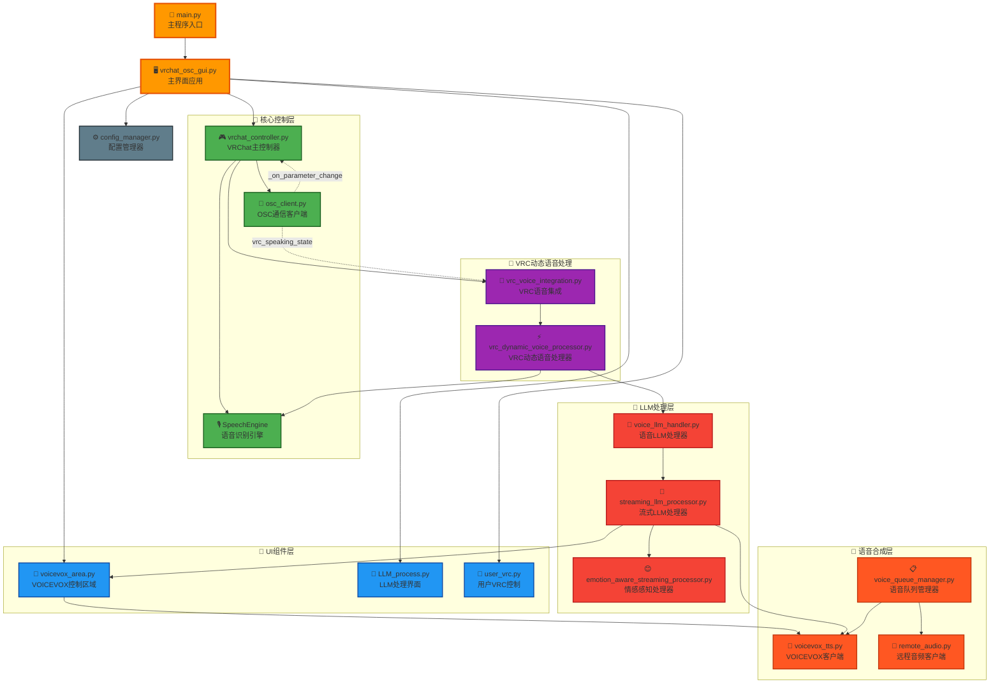

## 详细函数调用关系

### 1. 主程序启动流程

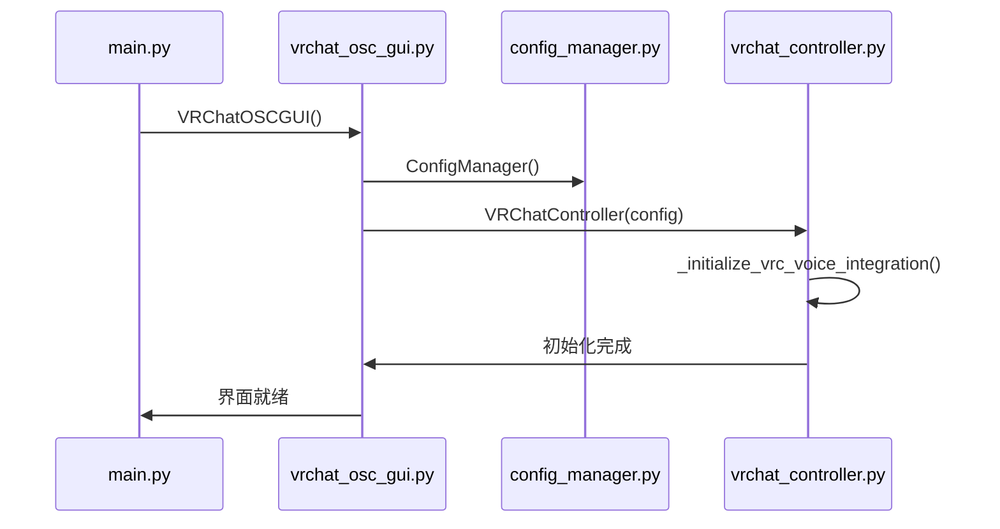

### 2. VRC参数变化处理流程

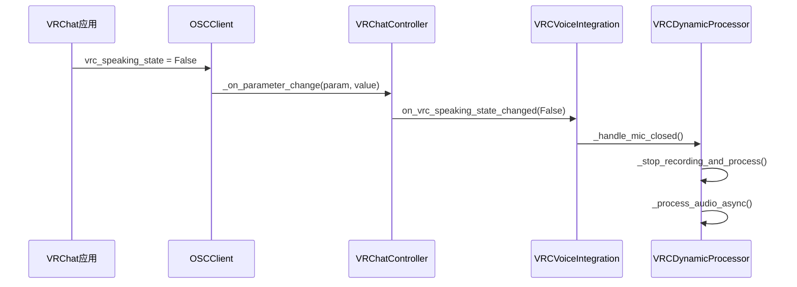

### 3. 语音识别到LLM处理流程

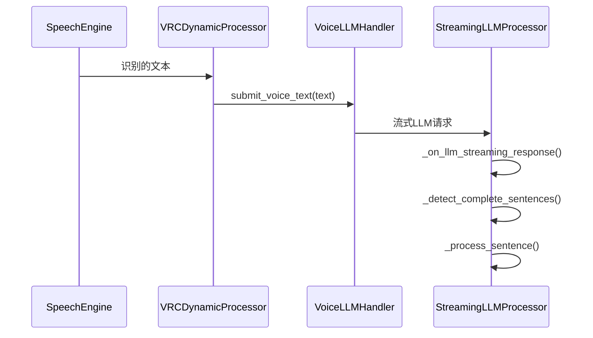

### 4. 流式语音合成播放流程

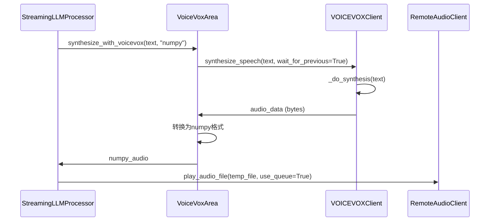

## 关键类和方法详细结构

### VRChatController 核心方法
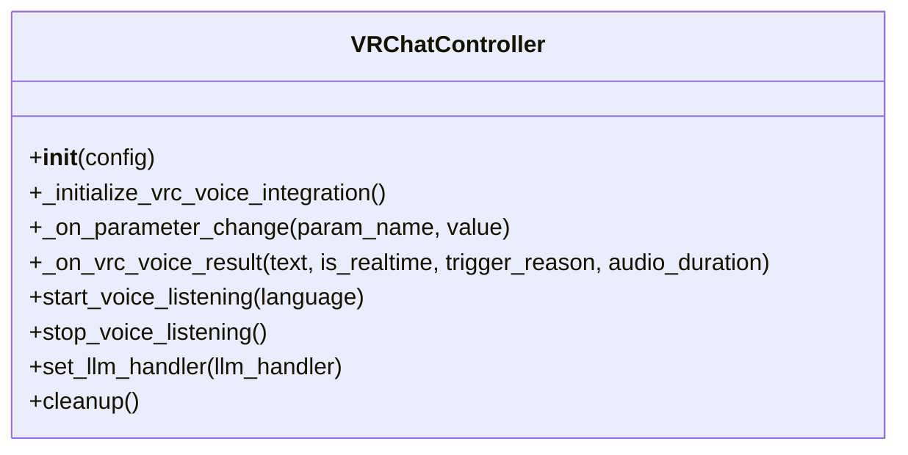

### VRCDynamicVoiceProcessor 核心方法
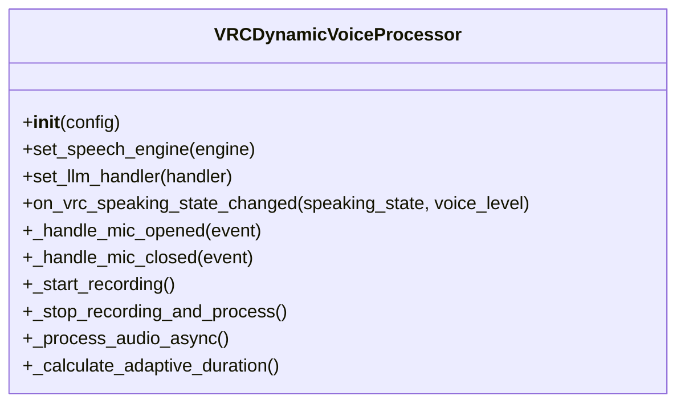

### StreamingLLMProcessor 核心方法
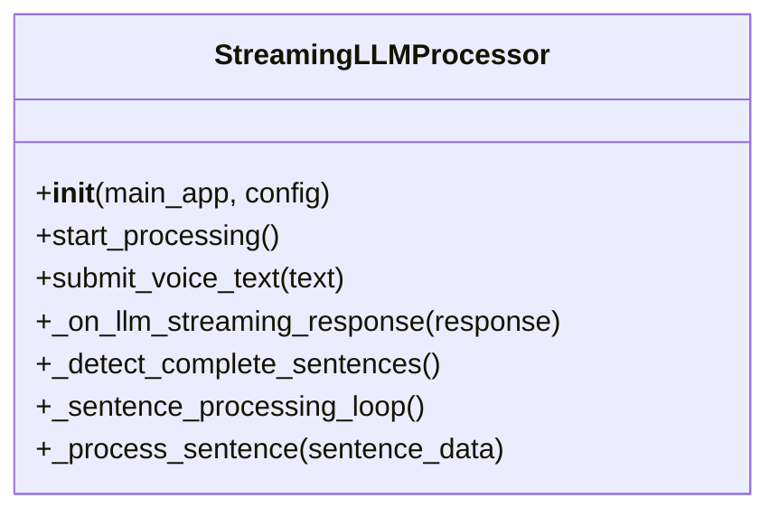

### VOICEVOXClient 核心方法
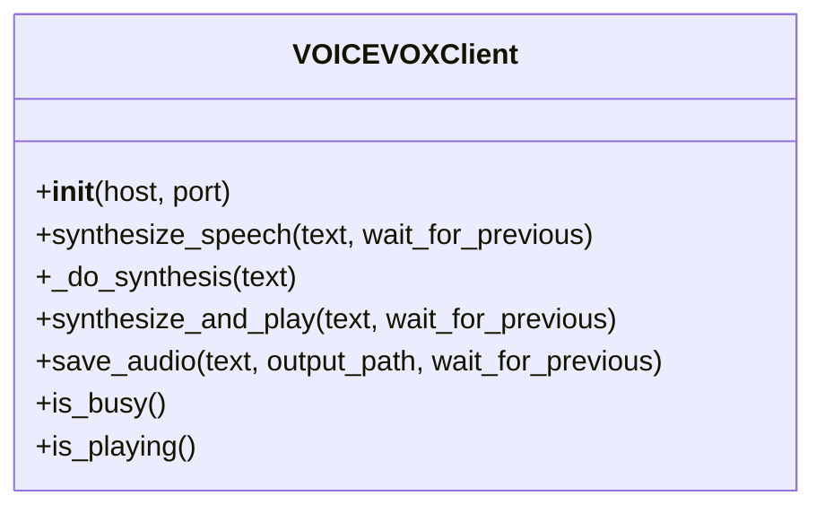

## 配置文件和依赖关系

### 配置管理结构
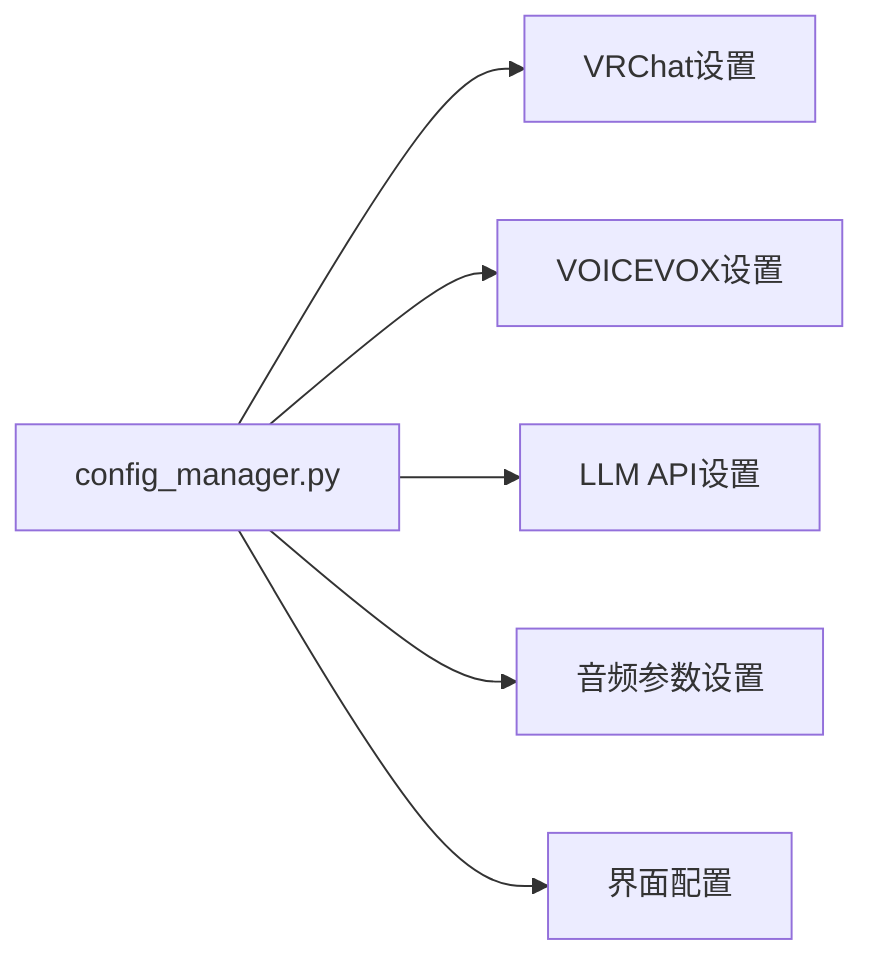

### 主要依赖库
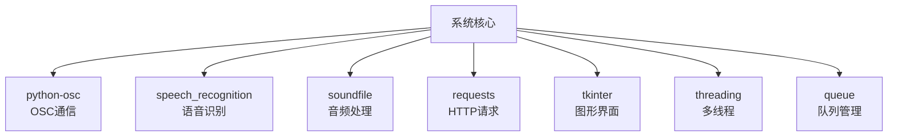

## 数据流和状态管理

### 全局状态管理
- **VRC状态**: `vrc_speaking_state`, `vrc_voice_level`
- **录音状态**: `RecordingState.IDLE/RECORDING/PROCESSING`
- **合成状态**: `is_synthesizing`, `synthesis_lock`
- **播放队列**: `voice_queue`, `sentence_queue`

### 关键回调函数
- `_on_parameter_change()`: OSC参数变化
- `_on_llm_streaming_response()`: LLM流式响应
- `_on_vrc_voice_result()`: VRC语音识别结果
- `_on_vrc_status_change()`: VRC状态变化

这个结构图展示了整个系统的完整架构，包括所有主要类、方法和它们之间的调用关系。