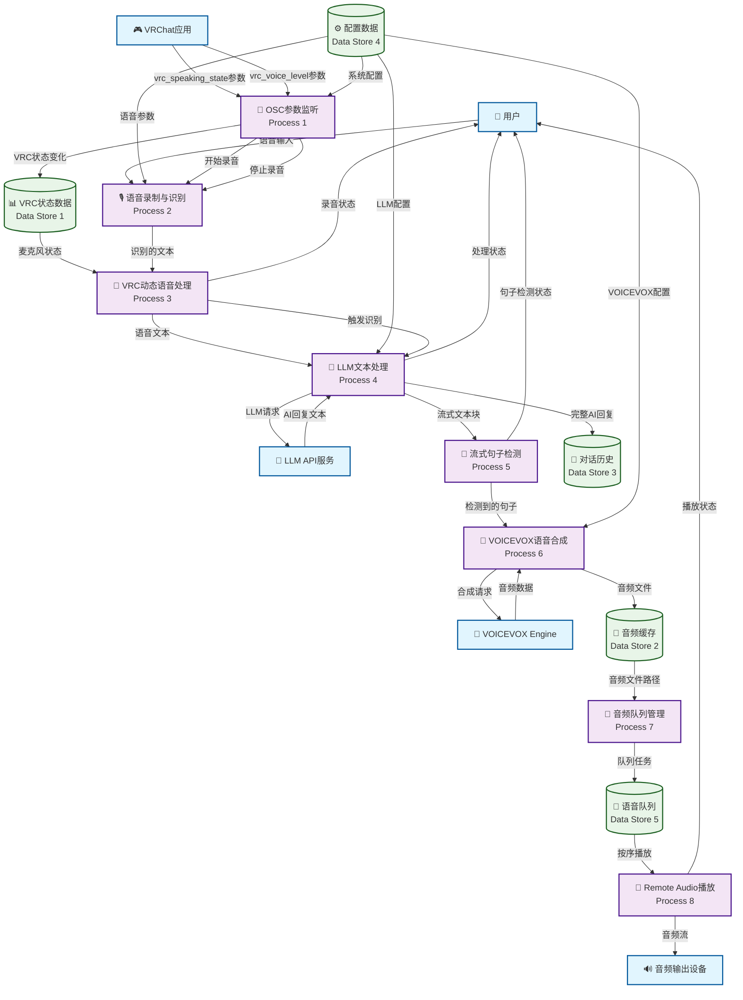

# VRChat OSC 语音识别和AI处理系统 - DFD数据流图

## 系统数据流图 (Data Flow Diagram)



## 数据流详细说明

### 外部实体 (External Entities)
- **👤 用户**: 通过麦克风提供语音输入，接收系统状态反馈
- **🎮 VRChat应用**: 发送OSC参数(speaking_state, voice_level)
- **🎤 VOICEVOX Engine**: 提供语音合成服务
- **🤖 LLM API服务**: 处理自然语言对话
- **🔊 音频输出设备**: 播放合成的语音

### 主要处理过程 (Processes)
1. **🎯 OSC参数监听**: 监听VRChat的OSC参数变化
2. **🎙️ 语音录制与识别**: 录制用户语音并转换为文本
3. **🧠 VRC动态语音处理**: 根据VRC状态控制录音和识别
4. **💬 LLM文本处理**: 将语音文本发送给AI并获取回复
5. **📝 流式句子检测**: 实时检测AI回复中的完整句子
6. **🎵 VOICEVOX语音合成**: 将文本句子转换为语音
7. **📡 音频队列管理**: 管理语音播放队列确保顺序
8. **🔄 Remote Audio播放**: 通过9003端口播放音频

### 数据存储 (Data Stores)
- **📊 VRC状态数据**: 存储当前VRChat状态信息
- **🎵 音频缓存**: 临时存储合成的音频文件
- **💭 对话历史**: 保存AI对话上下文
- **⚙️ 配置数据**: 系统配置参数
- **🎼 语音队列**: 音频播放队列管理

## 关键数据流路径

### 语音输入到AI回复的完整流程
```
用户语音 → 录制识别 → VRC动态处理 → LLM处理 → AI文本回复
```

### AI回复到语音播放的流式处理
```
AI流式回复 → 句子检测 → VOICEVOX合成 → 队列管理 → 按序播放
```

### VRC状态控制的录音管理
```
VRChat状态 → OSC监听 → 状态存储 → 动态处理 → 控制录音开始/停止
```

## 系统特点

1. **实时流式处理**: AI回复边生成边合成语音，减少等待时间
2. **VRC状态感知**: 根据VRChat麦克风状态智能控制录音
3. **队列化音频播放**: 确保语音按正确顺序连续播放
4. **模块化设计**: 各处理过程独立，便于维护和扩展